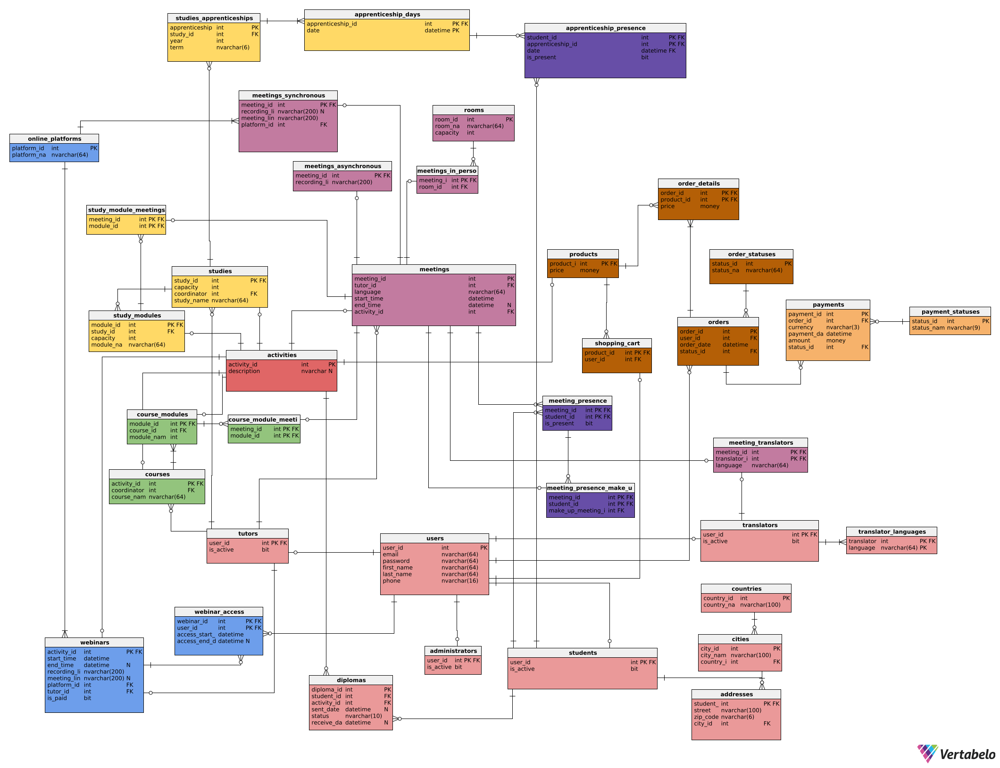

# Learning-Platform-DB
## Table of contents:
* [General info](#general-info)
* [Used technologies](#used-technologies)
* [Diagram](#diagram)
* [Functionalities](#functionalities)
* [Authors](#authors)
### General info
The aim of this project is to design and implement database system for a fictional company that organizes trainings and courses that are conducted in a hybrid model (stationary and online). The system enables the management of information about webinars, courses and studies, taking into account various forms of participation. Project was carried out as part of 'Basics of databases' course at AGH UST in 3-person team. A detailed documentation can be found [here](Dokumentacja.pdf) (in polish).
### Used technologies
* Vertabelo Database Modeler - for designing database diagram, defining  integrity constraints, generating code for creating tables 
* MS SQL Server - implementation of designed db
* dbForge Data Generator for SQL Server - data generation for test purposes
### Diagram

# Functionalities
* [Tables generation](db_create.sql)
* [Stored procedures](procedures.sql)
* [Functions](functions.sql)
* [Trigger](trigger.sql)
* [Views](views.sql)
* [Indexes](indexes.sql)
### Authors
* Natalia Wrześniak
* Izabela Szpunar
* Maria Stalmach
